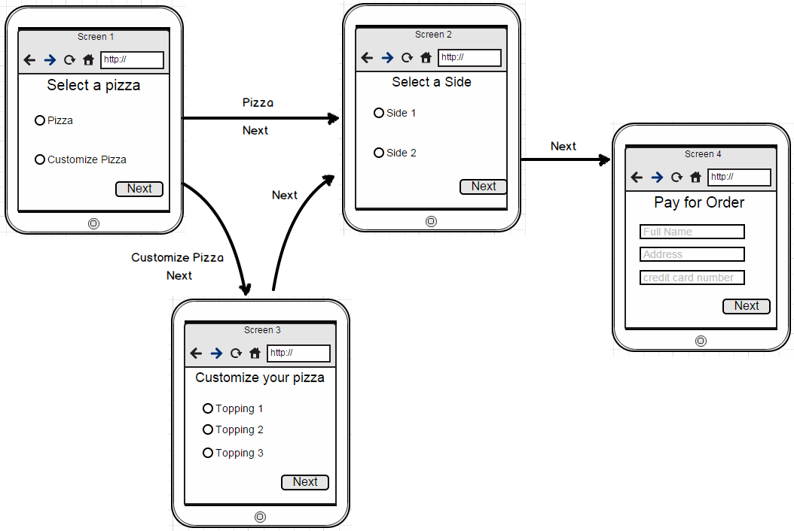
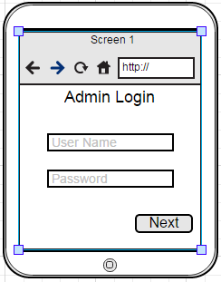
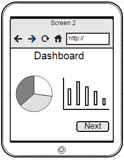
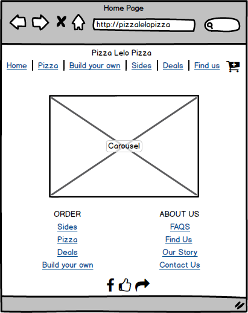
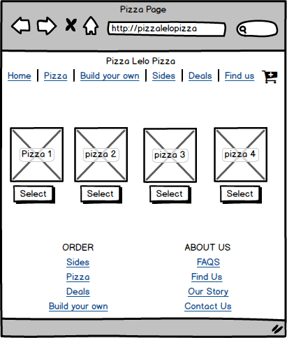
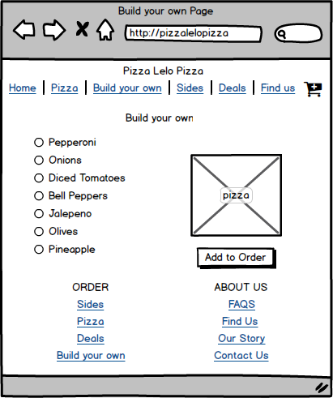
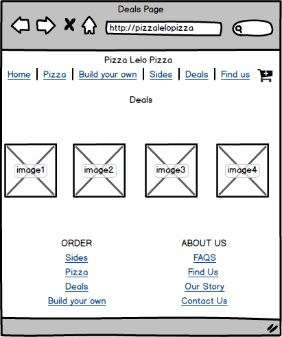
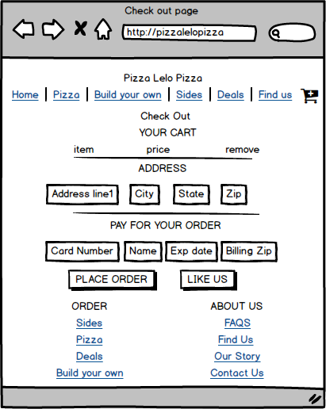
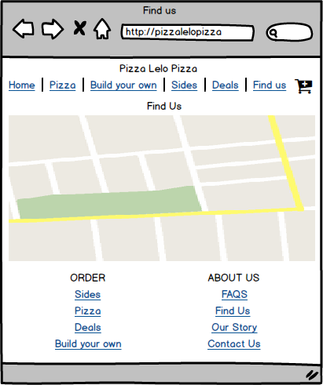

# A full fledge website for pizza restaurants with analytics of sales
## Website live at:
http://pizzalelopizza-pizzalelopizza.rhcloud.com/

# Features
* Responsive
* Localization (multi-lingual)
* Cross browser
* High SEO score
* JMeter Stress test took average of 5 secs to process 1000 requests

# Underlying Technology
* HTML5
* CSS
* JavaScript
* JQuery
* NodeJS
* AngularJS
* Bootstrap
* MySQL
* HighCharts

# WireFrames and Story board
### Story board for User

### Story board for Admin

### Wireframes

# Appendix
This is a school project (non-commercial)
Thanks to
* https://www.openshift.com/
* [JQwidgets] (http://www.jqwidgets.com/license/)
